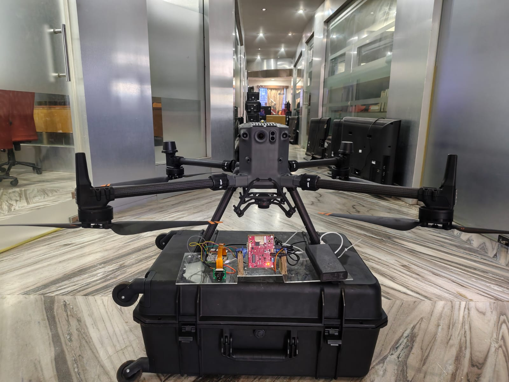
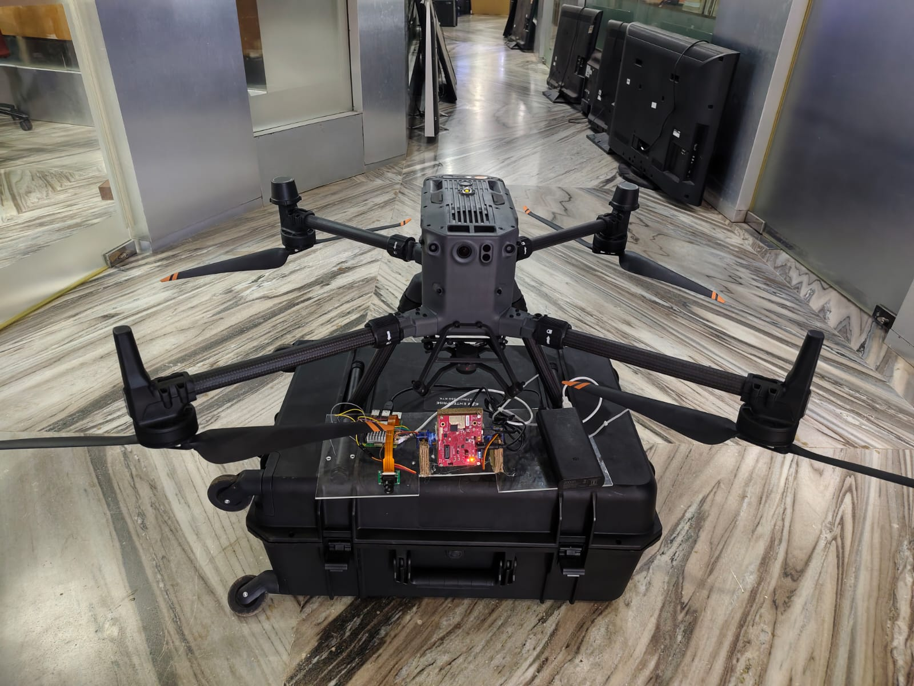
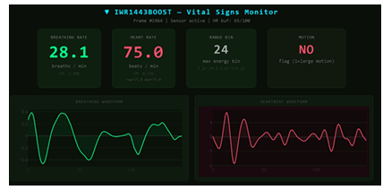

# 🚁 Search and Rescue Using Drones — YOLOv8 + mmWave Radar


## 📄 Publications

| Paper | Publisher | Status |
|---|---|---|
| Integrated UAV Multi-Sensor Framework for Landslide SAR Victim Detection & Physiological Triage | **Springer — Progress in Landslide Research and Technology, Vol.5** (WLF7 2026) | Submitted |
| Real-Time UAV Vision System for Semi-Buried Human Detection in Landslide SAR | **Springer — Progress in Landslide Research and Technology, Vol.5** (WLF7 2026) | Submitted |

> Both papers submitted to the **7th World Landslide Forum (WLF7)**
> Springer Nature Switzerland AG

## 📌 Overview
A two-component Search and Rescue (SAR) system combining:
- 🎯 **YOLOv8n** — real-time aerial human detection from drone camera
- 📡 **TI IWR1443 mmWave Radar** — contactless vital signs monitoring
  (breathing rate + heart rate) for located survivors

Fully deployed on **Raspberry Pi** for edge-based real-time inference
onboard drones — no cloud or external server required.

**Research Internship — Wireless Network & Application Research Lab,
Amrita Vishwa Vidyapeetham, Amritapuri (March 2026 – Present)**

---

## 🏆 YOLOv8 Model Performance (100 Epochs)

| Metric | Value |
|---|---|
| **mAP50** | **99.33%** |
| **mAP50-95** | **95.41%** |
| **Precision** | **99.19%** |
| **Recall** | **99.67%** |
| Base Model | YOLOv8n |
| Image Size | 960×960 |
| Dataset | disaster.v1i.yolov8 |

---

## 📡 mmWave Radar — Vital Signs Monitor

### Hardware: TI IWR1443BOOST (77GHz FMCW)

| Feature | Detail |
|---|---|
| Breathing Rate | 0–30 breaths/min |
| Heart Rate | 40–180 BPM |
| Detection Range | 0.3m – 1.0m |
| Mode | Contactless, through-clothing |
| Dashboard | Real-time Flask + Socket.IO + Plotly |
| Frame Rates | 10 / 20 / 30 FPS configs |

---

## 🧠 Model Files

| Model | Format | Size | Best For |
|---|---|---|---|
| `best.pt` | PyTorch | 6.1 MB | Training & fine-tuning |
| `best.onnx` | ONNX | 12 MB | Cross-platform |
| `best_320.onnx` | ONNX 320px | 12 MB | Fastest — Raspberry Pi |
| `best_416.onnx` | ONNX 416px | 12 MB | Balanced |
| `best_640.onnx` | ONNX 640px | 12 MB | Best accuracy |

---

## 🛠️ Tech Stack
| Component | Technology |
|---|---|
| Human Detection | YOLOv8n (Ultralytics) |
| Computer Vision | OpenCV |
| Framework | PyTorch |
| Edge Deployment | Raspberry Pi + ONNX |
| Camera | Pi Camera (rpicam-vid) / USB Webcam |
| Vital Signs | TI IWR1443BOOST mmWave Radar |
| Dashboard | Flask + Socket.IO + Plotly |
| Streaming | TCP Socket (port 8554) |
| Communication | PySerial (UART 921600 baud) |

---

## ⚙️ Raspberry Pi Deployment

### `raspberry_pi/main_best.py` — PyTorch (.pt) Model
- Pi Camera via `rpicam-vid` MJPEG pipeline
- TCP live stream to laptop (port 8554)
- Auto video recording to `/home/pi/.../videos/`
- JSON detection logging
- Live window on Pi screen

### `raspberry_pi/main_onnx.py` — ONNX Model (faster)
- Same features as above
- Uses `best_320.onnx` for maximum speed on Pi
- Automatic ONNX coordinate normalization fix
- Lower FPS target (15fps) for stable edge inference

---

## 📁 Project Structure
```
drone-search-rescue-yolov8/
├── training/
│   └── train_disaster.ipynb         # YOLOv8 training pipeline
├── inference/
│   ├── test_lap.py                  # Laptop camera detection
│   └── test_web.py                  # USB webcam detection
├── raspberry_pi/
│   ├── main_best.py                 # Pi deployment — .pt model
│   └── main_onnx.py                 # Pi deployment — .onnx model
├── radar/
│   ├── vital_signs.py               # Vital signs + Flask dashboard
│   ├── multiple_configs.py          # Multi-config radar scheduler
│   ├── iwr1443_config.cfg           # Main radar config
│   ├── 10fps.cfg                    # 10 FPS mode
│   ├── 20fps.cfg                    # 20 FPS mode (recommended)
│   └── 30fps.cfg                    # 30 FPS mode
├── models/
│   ├── best.pt                      # YOLOv8 trained weights
│   ├── best.onnx                    # ONNX default
│   ├── best_320.onnx                # ONNX 320px (Pi optimized)
│   ├── best_416.onnx                # ONNX 416px
│   └── best_640.onnx                # ONNX 640px
├── results/
│   ├── results.csv                  # 100 epochs training log
│   └── simulation_results.png       # Training curves
└── docs/
    ├── vital_signs_dashboard.png    # IWR1443 Flask dashboard
    ├── Drone_with_payload.jpeg      # Drone + radar hardware
    ├── Drone_with_payload_1.jpeg    # Drone aerial view
    └── usb_webcam_output.mp4        # Detection demo video
```

---

## 🚀 How to Run

### Install Dependencies
```bash
pip install -r requirements.txt
```

### Raspberry Pi — PyTorch Model
```bash
python raspberry_pi/main_best.py
# Press Q to quit | TCP stream on port 8554
```

### Raspberry Pi — ONNX Model (faster)
```bash
python raspberry_pi/main_onnx.py
# Press Q to quit | TCP stream on port 8554
```

### Laptop Camera Detection
```bash
python inference/test_lap.py
```

### USB Webcam Detection
```bash
python inference/test_web.py
```

### mmWave Vital Signs Monitor
```bash
python radar/vital_signs.py
# Open browser: http://<raspberry-pi-ip>:5000
```

### Multi-Config Radar
```bash
python radar/multiple_configs.py
```

### Train from Scratch
```bash
jupyter notebook training/train_disaster.ipynb
```

---

## 📸 Hardware Demo

| Drone Front View | Drone Top View |
|---|---|
|  |  |

> DJI Matrice drone carrying TI IWR1443BOOST mmWave radar
> and Raspberry Pi for onboard edge inference.

---

## 📊 System Results

### Detection Results


### Vital Signs Dashboard


> Real-time Flask dashboard showing breathing rate (28.1 bpm),
> heart rate (75.0 bpm), range bin, motion flag, and waveforms.

---

## 🎥 Demo Video
| Video | Description |
|---|---|
| [usb_webcam_output.mp4](docs/usb_webcam_output.mp4) | Real-time YOLOv8 victim detection |

---

## 📈 Training Progress
- mAP50 jumped from **45.9% → 99.33%** over 100 epochs
- Full log: `results/results.csv`

---

## 🔬 Research Context
Part of the **Search and Rescue using Drones** research at
Wireless Network & Application Research Lab, Amrita Vishwa Vidyapeetham.
Detects survivors using YOLOv8n from aerial drone data and monitors
vital signs using mmWave radar — all on Raspberry Pi edge deployment.

---

## 👤 Author
**Achuoth Akol Achuoth Deng**, Saikishen P V, Praveen K, Sangeeth Kumar, Sethuraman N. Ra
Center for Wireless Networks and Applications (WNA),
Amrita Vishwa Vidyapeetham, Amritapuri, India
[LinkedIn](https://linkedin.com/in/achuoth-akol-achuoth-deng) · [GitHub](https://github.com/Achuoth11)
