# 🚁 Use of Drones to Effectively Rescue Trapped Victims in Collapsed Buildings


## 📄 Publications

| Paper | Conference | Status |
|---|---|---|
| **Real-Time Detection of Partially Occluded Victims in Disaster Search and Rescue** | ICONAT 2026 (Paper ID: 2759) | Submitted |
| **Integrated UAV-Mounted Multi-Sensor Framework for Real-Time Detection and Physiological Triage of Landslide-Trapped Victims** | ICRM 2026 (Paper ID: 784) | Submitted |

> **Research Project:** Use of Drones to Effectively Rescue Trapped Victims in Collapsed Buildings
> **Lab:** Center for Wireless Networks and Applications (WNA), Amrita Vishwa Vidyapeetham, Amritapuri

---

## 📌 Overview
A two-component Search and Rescue (SAR) system combining:
- 🎯 **YOLOv8n** — real-time aerial human detection from drone camera, including partially occluded victims (limbs, face-only, buried torsos)
- 📡 **TI IWR1443BOOST mmWave Radar** — contactless vital signs monitoring (breathing rate + heart rate) for located survivors

Fully deployed on **Raspberry Pi 5** for edge-based real-time inference onboard drones — no cloud or external server required.

**Research Internship — Wireless Network & Application Research Lab,
Amrita Vishwa Vidyapeetham, Amritapuri (March 2026 – Present)**

---

## 🏆 YOLOv8 Model Performance (100 Epochs)

| Metric | Value |
|---|---|
| **mAP50** | **99.33%** |
| **mAP50-95** | **95.41%** |
| **Precision** | **99.19%** |
| **Recall** | **99.67%** |
| **F1 Score** | **99.43%** |
| True Positives | 1,223 |
| False Negatives | 3 |
| False Positives | 9 |
| Base Model | YOLOv8n |
| Image Size | 960×960 |
| Dataset | Victim/Occluded Detection v2 (7,470 images) |

---

## 📡 mmWave Radar — Vital Signs Monitor

### Hardware: TI IWR1443BOOST (77GHz FMCW)

| Feature | Detail |
|---|---|
| Breathing Rate | 0–30 breaths/min (±1 br/min accuracy) |
| Heart Rate | 40–180 BPM (±2 bpm accuracy) |
| Detection Range | 0.3m – 1.0m |
| Mode | Contactless, through-clothing & debris |
| Processing | Python + PySerial custom signal pipeline |
| Visualization | Python Matplotlib + Flask Dashboard |
| Frame Rates | 10 / 20 / 30 FPS configs |

---

## 🧠 Model Files

| Model | Format | Size | Best For |
|---|---|---|---|
| `best.pt` | PyTorch | 6.1 MB | Training & fine-tuning |
| `best.onnx` | ONNX | 12 MB | Cross-platform |
| `best_320.onnx` | ONNX 320px | 12 MB | Fastest — Raspberry Pi |
| `best_416.onnx` | ONNX 416px | 12 MB | Balanced |
| `best_640.onnx` | ONNX 640px | 12 MB | Best accuracy |

---

## 🛠️ Tech Stack

| Component | Technology |
|---|---|
| Human Detection | YOLOv8n (Ultralytics) |
| Computer Vision | OpenCV |
| Framework | PyTorch / ONNX Runtime |
| Edge Deployment | Raspberry Pi 5 (8GB) |
| Camera | Pi Camera Module 3 / USB Webcam |
| Vital Signs Sensor | TI IWR1443BOOST mmWave Radar (77GHz) |
| Vital Signs Processing | Python + PySerial custom signal pipeline |
| Dashboard | Python Matplotlib + Flask + Socket.IO |
| Streaming | TCP Socket (port 8554) |
| Communication | UART (921600 baud) |

---

## ⚙️ Raspberry Pi Deployment

### `raspberry_pi/main_best.py` — PyTorch (.pt) Model
- Pi Camera via `rpicam-vid` MJPEG pipeline
- TCP live stream to laptop (port 8554)
- Auto video recording with JSON detection logging
- Live window on Pi screen

### `raspberry_pi/main_onnx.py` — ONNX Model (faster)
- Uses `best_320.onnx` for maximum speed on Pi
- **15.4 FPS** — 7× speedup over PyTorch baseline
- Automatic ONNX coordinate normalization fix

---

## 📁 Project Structure

```
drone-search-rescue-yolov8/
├── training/
│   └── train_disaster.ipynb            # YOLOv8 training pipeline
├── inference/
│   ├── test_lap.py                     # Laptop camera detection
│   └── test_web.py                     # USB webcam detection
├── raspberry_pi/
│   ├── main_best.py                    # Pi deployment — .pt model
│   └── main_onnx.py                    # Pi deployment — .onnx model
├── radar/
│   ├── vital_signs.py                  # Vital signs + Flask dashboard
│   ├── multiple_configs.py             # Multi-config radar scheduler
│   ├── iwr1443_config.cfg              # Main radar config
│   ├── 10fps.cfg                       # 10 FPS mode
│   ├── 20fps.cfg                       # 20 FPS mode (recommended)
│   └── 30fps.cfg                       # 30 FPS mode
├── models/
│   ├── best.pt                         # YOLOv8 trained weights
│   ├── best.onnx                       # ONNX default
│   ├── best_320.onnx                   # ONNX 320px (Pi optimized)
│   ├── best_416.onnx                   # ONNX 416px
│   └── best_640.onnx                   # ONNX 640px
├── results/
│   ├── results.csv                     # 100 epochs training log
│   └── simulation_results.png          # Training curves
└── docs/
    ├── detection/
    │   ├── detect_sitting.png          # Full body seated (0.70)
    │   ├── detect_legs.png             # Legs only (0.83)
    │   ├── detect_face1.png            # Face only (0.80)
    │   ├── detect_face2.png            # Partial face (0.83)
    │   └── detect_arm.png              # Arm only (0.68)
    ├── raspberry_pi/
    │   ├── pi_leg_detected.png         # Pi: leg detection (0.52)
    │   └── pi_head_detected.png        # Pi: head detection (0.52)
    ├── hardware/
    │   ├── drone_front_view.jpeg       # Drone front with payload
    │   ├── drone_top_view.jpeg         # Drone top view
    │   ├── drone_side_view.jpeg        # Drone side view
    │   ├── Drone_with_payload.jpeg     # Indoor hardware setup 1
    │   └── Drone_with_payload_1.jpeg   # Indoor hardware setup 2
    └── vital_signs/
        ├── vital_signs_radar_1.jpeg    # BR=18, HR=77 BPM
        └── vital_signs_radar_2.jpeg    # BR=15, HR=68 BPM
```

---

## 🚀 How to Run

### Install Dependencies
```bash
pip install -r requirements.txt
```

### Raspberry Pi — ONNX Model (recommended)
```bash
python raspberry_pi/main_onnx.py
# Press Q to quit | TCP stream on port 8554
```

### Raspberry Pi — PyTorch Model
```bash
python raspberry_pi/main_best.py
```

### Laptop Camera Detection
```bash
python inference/test_lap.py
```

### USB Webcam Detection
```bash
python inference/test_web.py
```

### mmWave Vital Signs Monitor
```bash
python radar/vital_signs.py
# Open browser: http://<raspberry-pi-ip>:5000
```

### Multi-Config Radar
```bash
python radar/multiple_configs.py
```

### Train from Scratch
```bash
jupyter notebook training/train_disaster.ipynb
```

---

## 📸 Detection Results — Partial Occlusion Scenarios

| Seated Victim (0.70) | Legs Only (0.83) |
|---|---|
| 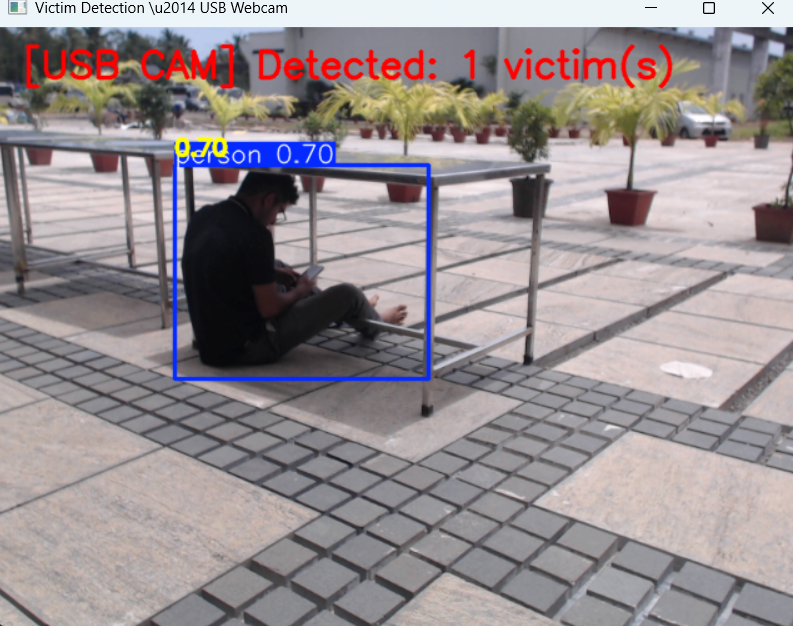 | 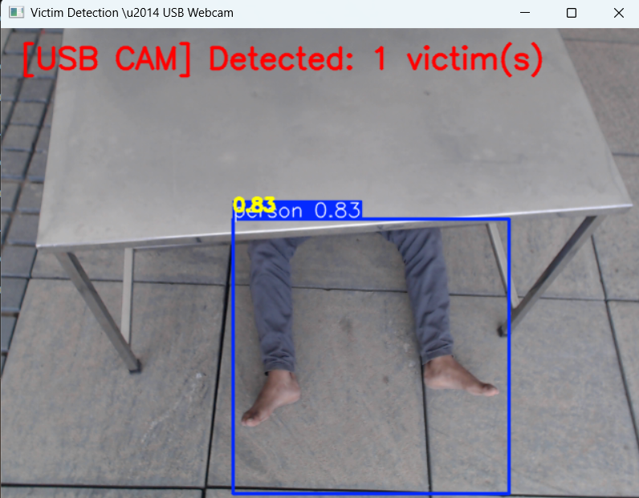 |

| Face Only (0.80) | Partial Face (0.83) |
|---|---|
| 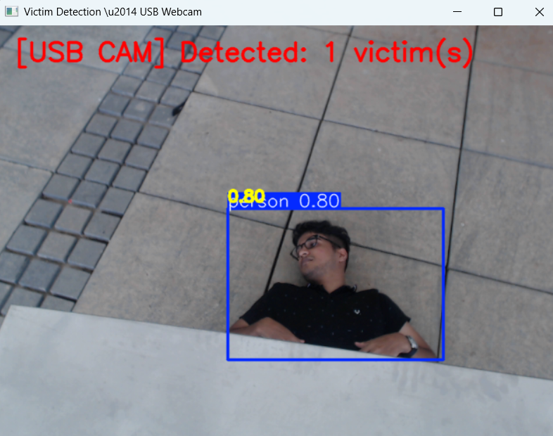 | 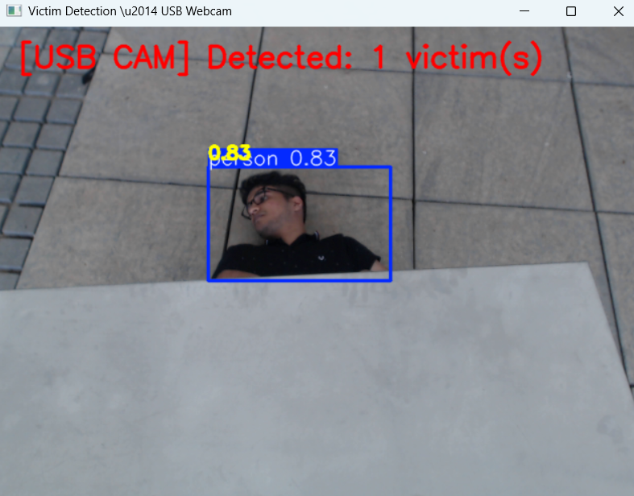 |

| Arm Only (0.68) |
|---|
| 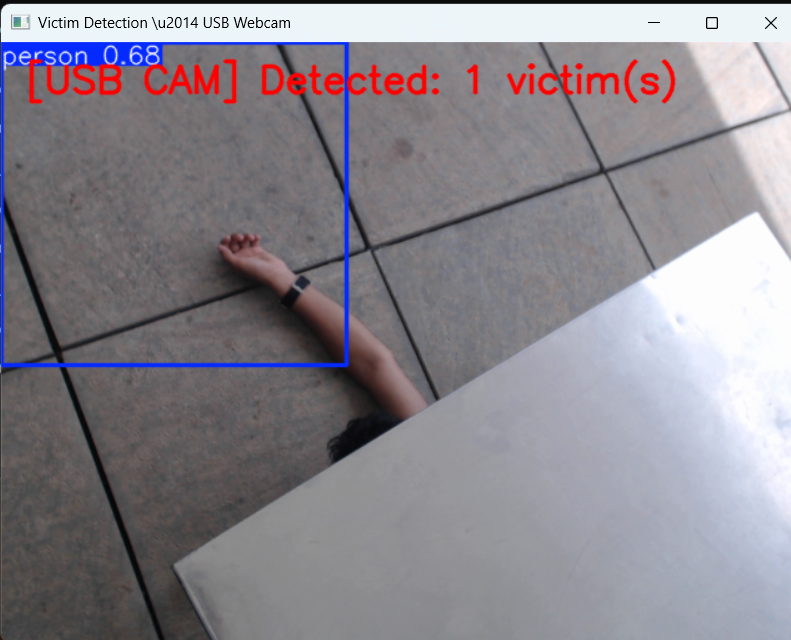 |

---

## 📸 Raspberry Pi — Live Inference Results

| Human Leg Detected (0.52) | Human Head Detected (0.52) |
|---|---|
| 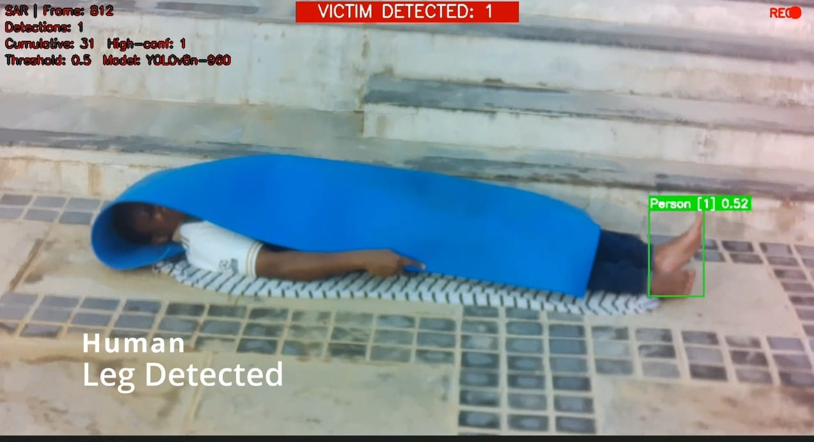 | 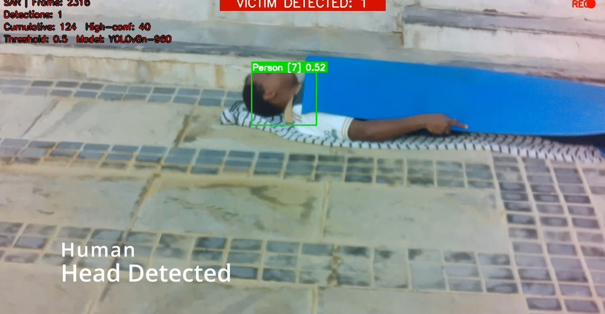 |

> Model: YOLOv8n-960 running via ONNX on Raspberry Pi 5
> Threshold: 0.5 | Real-time recording enabled (REC)

---

## 📸 Hardware — DJI Matrice 350 RTK + Payload

| Front View | Top View |
|---|---|
|  | 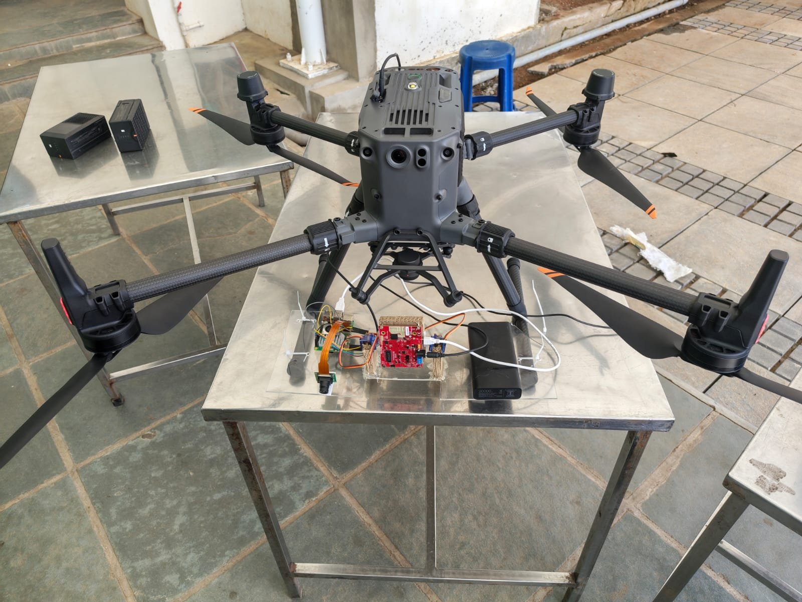 |

| Side View |
|---|
| 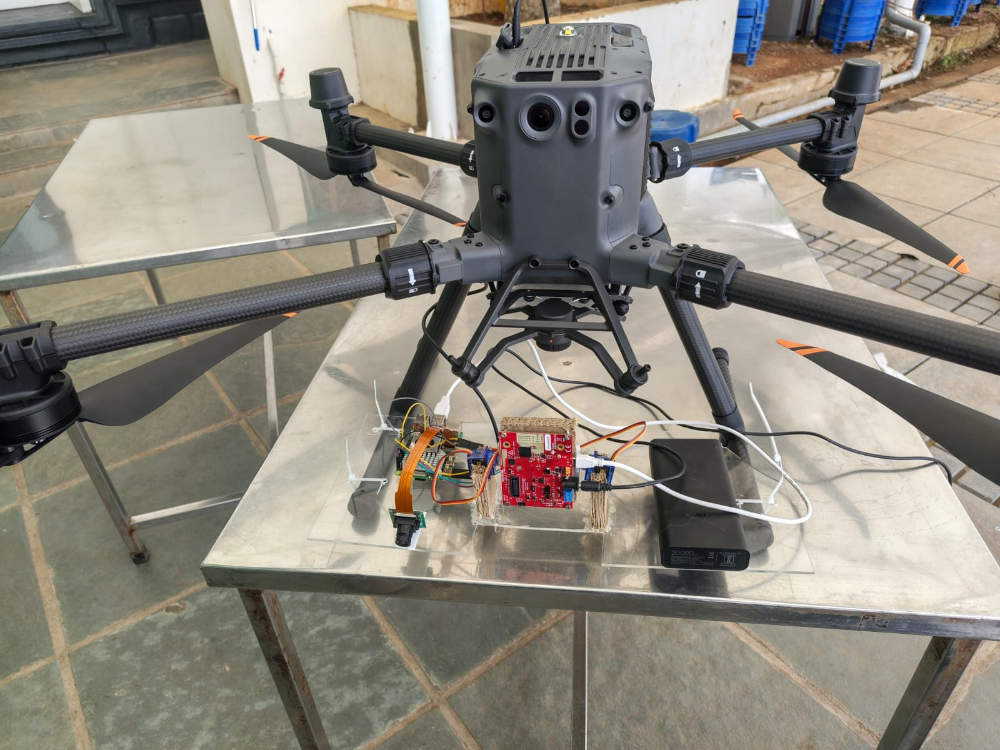 |

> DJI Matrice 350 RTK carrying:
> - TI IWR1443BOOST mmWave radar (red board)
> - Raspberry Pi 5 (8GB) as onboard compute
> - Pi Camera Module 3 (nadir-facing)
> - 20,000mAh / 65W USB-C power bank
> All mounted on acrylic payload plate

---

## 📊 Vital Signs — IWR1443BOOST mmWave Radar Results

| Trial 1: BR=18 br/min, HR=77 BPM | Trial 2: BR=15 br/min, HR=68 BPM |
|---|---|
| 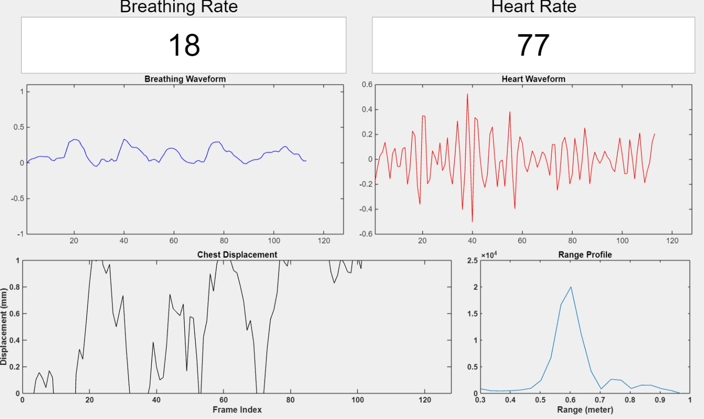 | 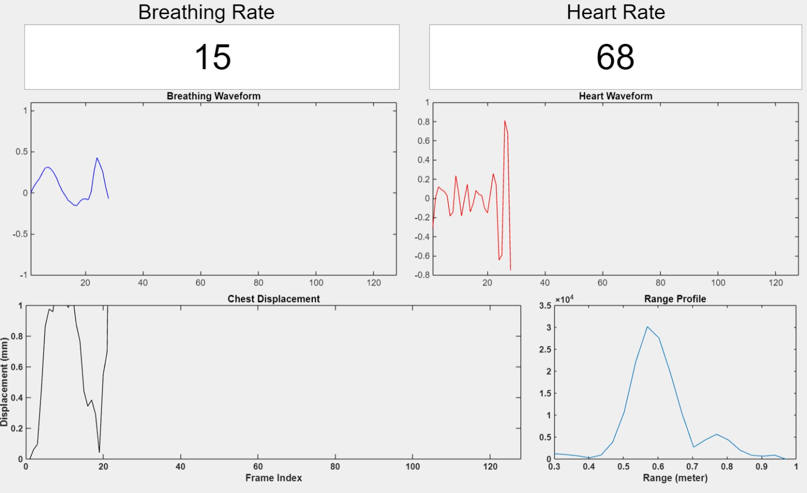 |

> Real-time vital signs extracted from TI IWR1443BOOST mmWave radar
> running on Raspberry Pi via custom Python + PySerial pipeline:
> - **Breathing Rate** — 15–18 breaths/min ✅ Normal range
> - **Heart Rate** — 68–77 BPM ✅ Normal range
> - **Breathing Waveform** — periodic chest oscillations (blue)
> - **Heart Waveform** — cardiac micro-Doppler signal (red)
> - **Chest Displacement** — mm-level thoracic motion (black)
> - **Range Profile** — victim located at ~0.6m from sensor (blue)

---

## 📈 Training Progress

| Epoch | mAP@0.5 | mAP@0.5:95 | Precision | Recall |
|---|---|---|---|---|
| 1 | 0.459 | 0.169 | 0.651 | 0.285 |
| 10 | 0.971 | 0.658 | 0.955 | 0.962 |
| 25 | 0.992 | 0.814 | 0.974 | 0.986 |
| 50 | 0.992 | 0.881 | 0.989 | 0.989 |
| 75 | 0.993 | 0.920 | 0.990 | 0.994 |
| **100** | **0.993** | **0.954** | **0.992** | **0.997** |

Full training log: `results/results.csv`

---

## 🎥 Demo Video

> Upload `Project_Preview_Video.mp4` to YouTube (can be Unlisted) then paste link:
```markdown
[](https://youtube.com/YOUR_LINK_HERE)
```

---

## 🔬 Research Context

This project is part of the WNA Lab research **"Use of Drones to Effectively Rescue Trapped Victims in Collapsed Buildings"** at the Center for Wireless Networks and Applications (WNA), Amrita Vishwa Vidyapeetham.

**Papers submitted:**
- **ICONAT 2026** (Paper ID: 2759) — *Real-Time Detection of Partially Occluded Victims in Disaster SAR*
- **ICRM 2026** (Paper ID: 784) — *Integrated UAV-Mounted Multi-Sensor Framework for Real-Time Detection and Physiological Triage*

---

## 👤 Authors
**Achuoth Akol Achuoth Deng**, Saikishen P V, Praveen K, Sangeeth Kumar, Sethuraman N. Rao
Center for Wireless Networks and Applications (WNA),
Amrita Vishwa Vidyapeetham, Amritapuri, India
[LinkedIn](https://linkedin.com/in/achuoth-akol-achuoth-deng) · [GitHub](https://github.com/Achuoth11)
